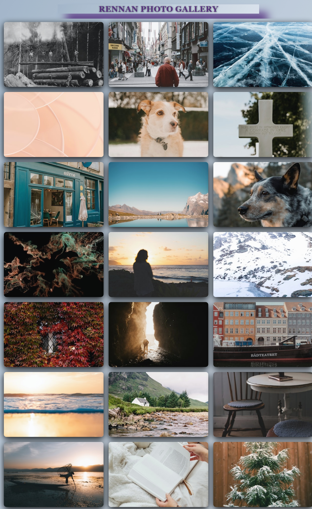

# Rennan Photo Gallery

This is a modern, responsive photo gallery built using **React** and powered by the **Unsplash API** to fetch random images. The gallery adjusts dynamically to different screen sizes, offering a clean, minimalist design.

## Features

- **Dynamic Image Fetching:** Displays random images from the Unsplash API.
- **Responsive Design:** Layout adjusts for desktop, tablet, and mobile devices.
- **Hover Effects:** Interactive hover effects on images for a better user experience.
- **Clean and Modern UI:** Minimal design with smooth animations and transitions.

## Demo

  
_Example of the photo gallery layout._

## Installation

To get this project up and running on your local machine:

### 1. Clone the repository

```bash
git clone https://github.com/lRennan/Gallery-photos.git
```

### 2. Navigate to the project directory

```bash
cd gallery
```

### 3. Install dependencies

```bash
npm install
```

### 4. Create an Unsplash API Access Key

- Go to the [Unsplash Developer page](https://unsplash.com/developers).
- Sign up or log in, and create a new application to get your **Access Key**.
- Replace the `accessKey` variable in `App.js` with your own API key.

### 5. Start the development server

```bash
npm start
```

Your app will be available at `http://localhost:3000`.

## Technologies Used

- **React**: For building the user interface.
- **Axios**: For making API requests to Unsplash.
- **CSS**: Custom styles for layout and animations.
- **Unsplash API**: For fetching random images.

### How to Contribute

1. Fork this repository.
2. Clone your forked repository.
3. Create a new branch (`git checkout -b feature/your-feature`).
4. Commit your changes (`git commit -am 'Add your feature'`).
5. Push to your branch (`git push origin feature/your-feature`).
6. Create a pull request.
